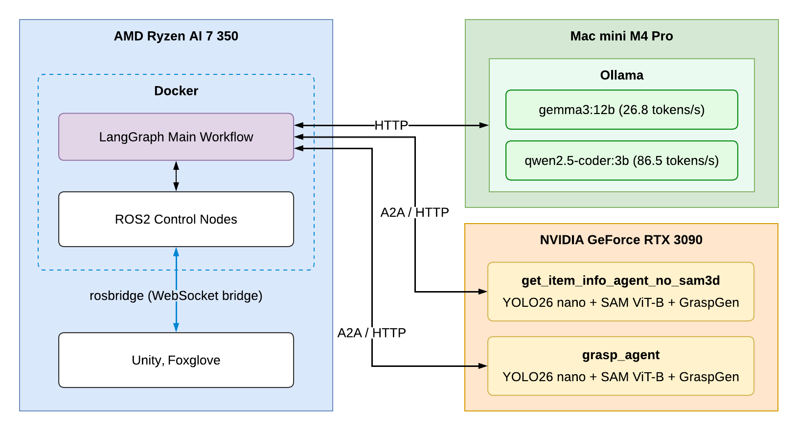
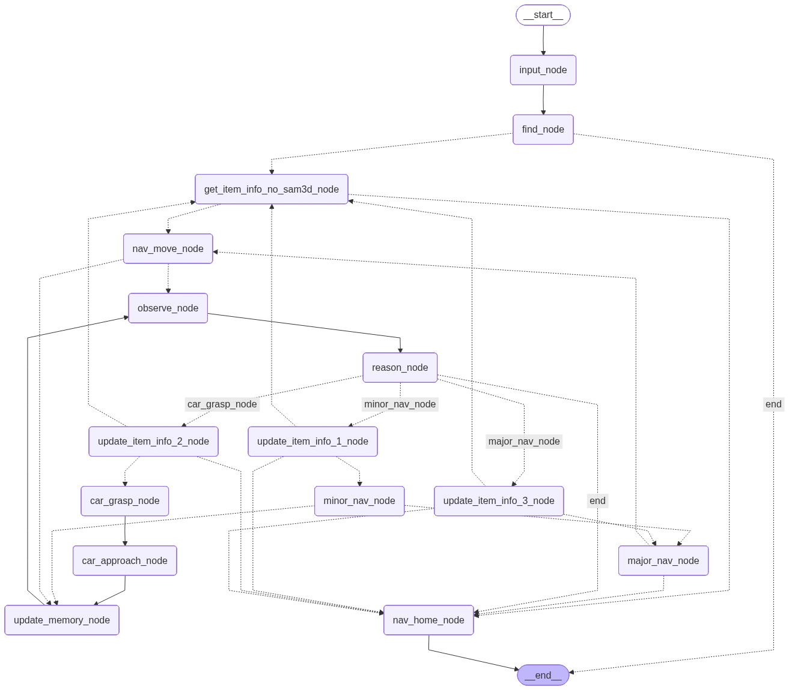

# pros_workflow

An active-perception grasping system deployed in a Unity/ROS2 environment. A local Commander maintains task state with LangGraph and makes high-level decisions with a local Ollama VLM. It drives the local ROS2 navigation/control stack and the A2A inference services on an RTX 3090 to complete: find object → navigate → grasp-pose generation → base approach and arm/gripper finish.



## Code layout

| Path | Contents |
|---|---|
| `src/` | ROS2 packages: `workflow_bringup` (runtime launch aggregator), `nav_goal_bridge_pkg` (Nav2 + goal bridge), `car_control_pkg`, `arm_control_pkg`, `action_interface`, `robot_description`. |
| `workflow/` | The non-ROS Commander: `web_main.py`/`main.py` entry points, `commander/` (LangGraph orchestrator, flows, brain, state/contracts, camera/nav/perception/storage/web), `agents/` (A2A clients and the car-approach runtime), `config/` (cameras/objects/runtime YAML). |
| `3090server/pros_workflow/` | RTX 3090 A2A inference services (item-info, grasp). See its [README](3090server/pros_workflow/README.md). |
| `docker/` | Dockerfile used to build the workflow image. |
| `scripts/` | In-container shell helpers (`env.sh` defines `run`/`web`) and the ROS runtime launcher (`start.sh`). |
| `docs/` | Architecture diagrams and deployment spec. |

## Runtime flow

The Commander is a LangGraph state machine (entry `greeting_node`). The main grasp path chains: `find_node` → `get_item_info_no_sam3d_node` → `nav_move_node` → `observe_node` → `reason_node` (VLM decision) → `major_nav_node` / `car_grasp_node` → `car_approach_node`. Each turn the VLM emits a `BrainDecision` (`call_module` ∈ `major_nav_node` / `grasp_agent` / `car_approach_agent` / `DONE`).



## Environment file (`.env`)

The Commander loads `.env` from the project root at startup. Required and common keys:

```env
# ROS
ROS_DOMAIN_ID=1

# Ollama (VLM brain)
OLLAMA_BASE_URL=http://<ollama-host>:11434
OLLAMA_MODEL=gemma3:12b
OLLAMA_CLASSIFIER_MODEL=gemma3:1b
OLLAMA_CHAT_MODEL=gemma3:12b

# RTX 3090 A2A inference services (IP:Port of the GPU servers)
INF_GET_ITEM_INFO_NO_SAM3D_URL=http://<gpu-host>:8006
INF_GRASP_URL=http://<gpu-host>:8007

# IP the GPU A2A servers advertise in their AgentCard url (read from this .env by the
# services — no need to pass EXTERNAL_IP on every launch). Must be an address the
# Commander can reach; if the Commander runs in a container use the host LAN IP or the
# docker-bridge gateway, NOT 127.0.0.1.
EXTERNAL_IP=<gpu-host>
```

Set `OLLAMA_BASE_URL` to point at your Ollama server, the two `INF_*` URLs at your RTX 3090 services, and `EXTERNAL_IP` to the GPU host's own address. When the Commander and the GPU services share one machine, `INF_*` and `EXTERNAL_IP` use that machine's LAN IP.

## Quick start (local Commander)

Build the image:

```bash
cd pros_workflow
docker build -t pros_workflow_image:latest -f docker/Dockerfile .
```

Terminal 1 — start the ROS runtime:

```bash
cd pros_workflow
./run.sh            # enter the pros_workflow container
r                   # build the ROS workspace (PROS image alias for rebuild_colcon.rc)
scripts/start.sh    # launch Nav2 / car / arm / rosbridge
# then play Unity.
```

Terminal 2 — start the web workflow:

```bash
cd pros_workflow
./run.sh
web 8080            # start workflow/web_main.py
# then open http://localhost:8080.
```

By default the `logs/` folder (trace log + session data) is deleted when the web server stops or is interrupted. Add `--keep-logs` (`web 8080 --keep-logs`) to keep it.

`./run.sh` only enters Docker (it does not build the image); it publishes `8080:8080` (web) and `9090:9090` (rosbridge), mounts the repo at `/workspace/pros_workflow`, and uses the venv at `/opt/pros_workflow_venv`. Rebuild the image after changing the Dockerfile or `workflow/pyproject.toml`; run `r` after changing ROS code.

## RTX 3090 setup

The perception/grasp inference runs on a separate RTX 3090 machine as A2A servers. On that machine:

1. Copy the `3090server/pros_workflow/` folder to the GPU host.
2. Build the conda env in one command — `bash setup_nv.sh` (NVIDIA/CUDA) or `bash setup_rocm.sh` (AMD/ROCm). See the [3090server README](3090server/pros_workflow/README.md) for details and the platform table.
3. Drop the model weights (YOLO / SAM / DepthAnything / SAM3D / GraspGen checkpoints) into `3090server/pros_workflow/models/` — only `.gitkeep` is committed.
4. Set `EXTERNAL_IP` in the `.env` (see above) to the GPU host's address — it is written into the A2A AgentCard `url`. Then launch the required services (they read `EXTERNAL_IP` from `.env`; a shell `EXTERNAL_IP=...` still overrides it):

   ```bash
   cd /path/to/pros_workflow/3090server/pros_workflow
   conda activate pros_workflow
   python -m get_item_info_agent_no_sam3d   # :8006 required
   python -m grasp_agent                    # :8007 required
   ```

5. Point the Commander `.env` at them: `INF_GET_ITEM_INFO_NO_SAM3D_URL=http://<gpu-host>:8006` and `INF_GRASP_URL=http://<gpu-host>:8007`.

See [3090server/pros_workflow/README.md](3090server/pros_workflow/README.md) for the full service list, ports, configs, and env overrides.
