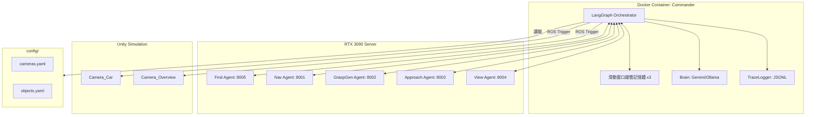
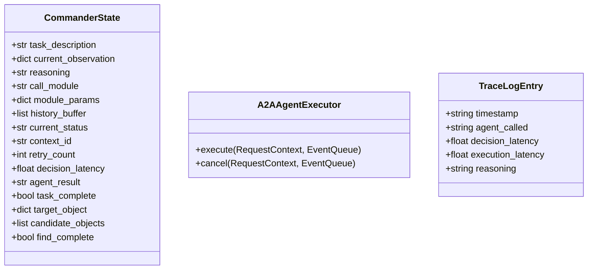
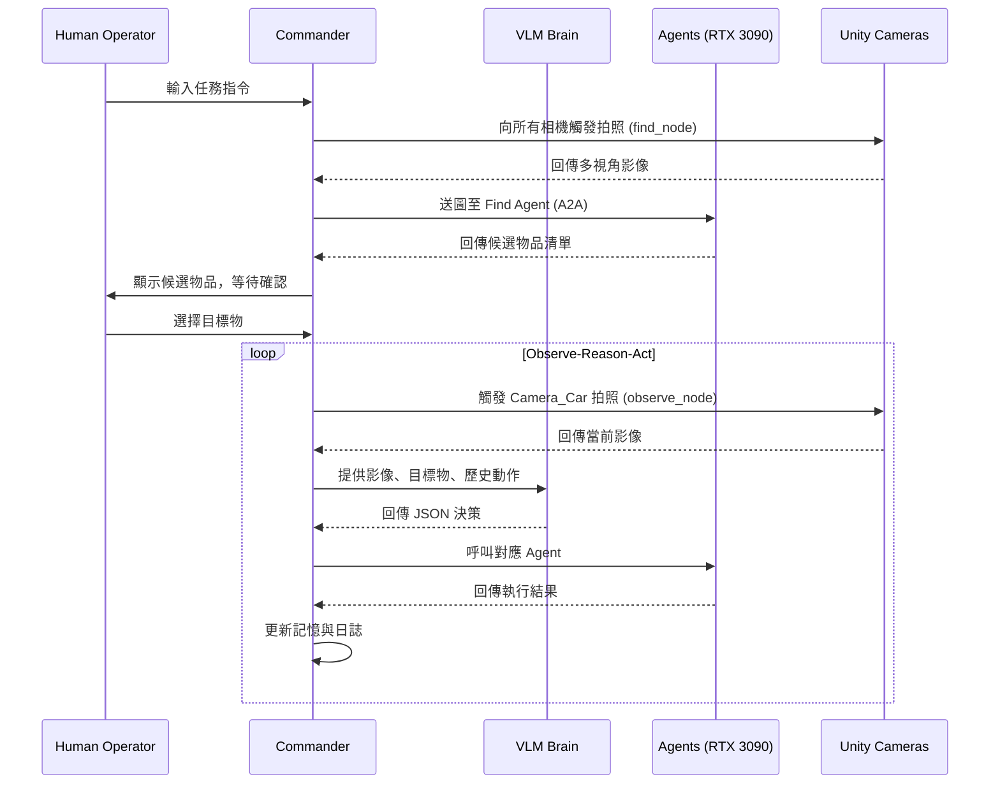
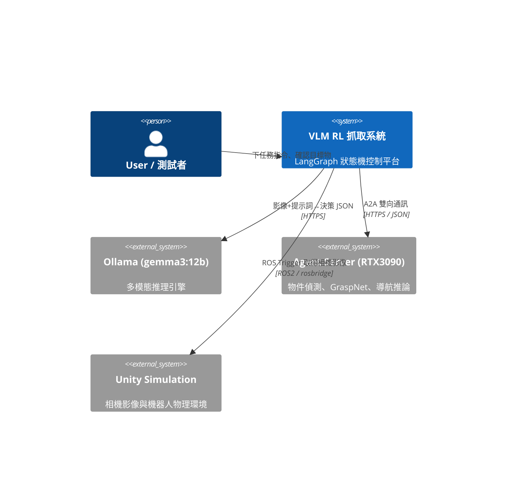
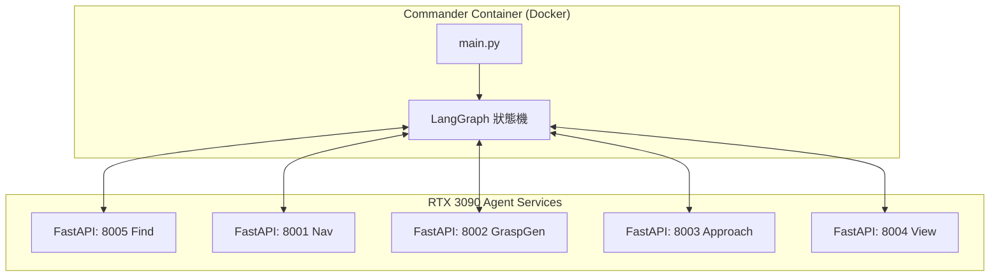
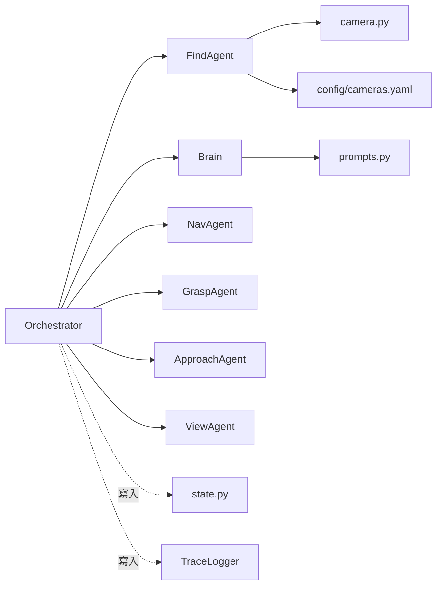
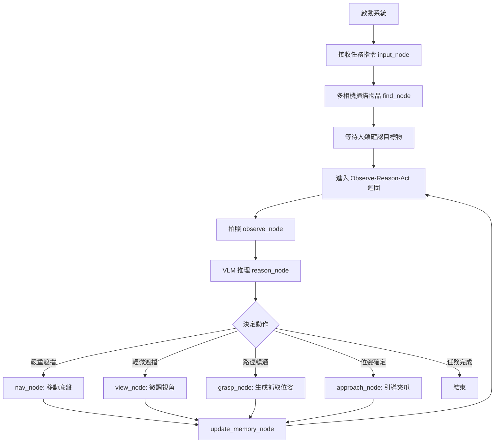
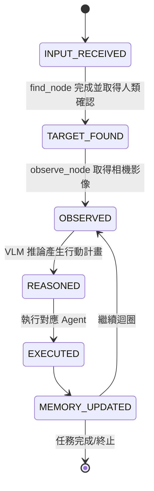

# 多代理人主動感知抓取系統 (VLM-RL) 規格文件

本文件描述基於 A2A 架構與 LangGraph 狀態機框架的具身智慧機器人系統架構。

## 1. 架構與選型

```mermaid
graph TD
  subgraph Commander [Docker Container: Commander]
    LG[LangGraph Orchestrator]
    Memory[滑動窗口緩衝記憶體 x3]
    Brain[Brain: Gemini/Ollama]
    Logger[TraceLogger: JSONL]
  end

  subgraph Executors [RTX 3090 Server]
    Find[Find Agent: 8005]
    Nav[Nav Agent: 8001]
    Grasp[GraspGen Agent: 8002]
    Approach[Approach Agent: 8003]
    View[View Agent: 8004]
  end

  subgraph Unity [Unity Simulation]
    Cam1[Camera_Car]
    Cam2[Camera_Overview]
  end

  subgraph Config [config/]
    cameras.yaml
    objects.yaml
  end

  LG --> Brain
  LG <--> Memory
  LG --> Logger
  LG <--> Find
  LG <--> Nav
  LG <--> Grasp
  LG <--> Approach
  LG <--> View
  LG -- ROS Trigger --> Cam1
  LG -- ROS Trigger --> Cam2
  LG -- 讀取 --> Config
```

## 2. 資料模型

```mermaid
classDiagram
  class CommanderState {
    +str task_description
    +dict current_observation
    +str reasoning
    +str call_module
    +dict module_params
    +list history_buffer
    +str current_status
    +str context_id
    +int retry_count
    +float decision_latency
    +str agent_result
    +bool task_complete
    +dict target_object
    +list candidate_objects
    +bool find_complete
  }
  class A2AAgentExecutor {
    +execute(RequestContext, EventQueue)
    +cancel(RequestContext, EventQueue)
  }
  class TraceLogEntry {
    +string timestamp
    +string agent_called
    +float decision_latency
    +float execution_latency
    +string reasoning
  }
```

## 3. 關鍵流程

```mermaid
sequenceDiagram
  participant H as Human Operator
  participant C as Commander
  participant V as VLM Brain
  participant A as Agents (RTX 3090)
  participant U as Unity Cameras

  H->>C: 輸入任務指令
  C->>U: 向所有相機觸發拍照 (find_node)
  U-->>C: 回傳多視角影像
  C->>A: 送圖至 Find Agent (A2A)
  A-->>C: 回傳候選物品清單
  C->>H: 顯示候選物品，等待確認
  H->>C: 選擇目標物
  loop Observe-Reason-Act
    C->>U: 觸發 Camera_Car 拍照 (observe_node)
    U-->>C: 回傳當前影像
    C->>V: 提供影像、目標物、歷史動作
    V-->>C: 回傳 JSON 決策
    C->>A: 呼叫對應 Agent
    A-->>C: 回傳執行結果
    C->>C: 更新記憶與日誌
  end
```

## 4. 系統脈絡圖

```mermaid
C4Context
  Person(user, "User / 測試者")
  System(vlm_rl, "VLM RL 抓取系統", "LangGraph 狀態機控制平台")
  System_Ext(ollama, "Ollama (gemma3:12b)", "多模態推理引擎")
  System_Ext(agent_server, "Agent Server (RTX3090)", "物件偵測、GraspNet、導航推論")
  System_Ext(unity, "Unity Simulation", "相機影像與機器人物理環境")

  Rel(user, vlm_rl, "下任務指令、確認目標物")
  Rel(vlm_rl, ollama, "影像+提示詞→決策 JSON", "HTTPS")
  Rel(vlm_rl, agent_server, "A2A 雙向通訊", "HTTPS / JSON")
  Rel(vlm_rl, unity, "ROS Trigger 取得相機影像", "ROS2 / rosbridge")
```

## 5. 容器/部署概觀

```mermaid
graph TD
  subgraph "Commander Container (Docker)"
    Main[main.py]
    LangGraph[LangGraph 狀態機]
  end

  subgraph "RTX 3090 Agent Services"
    S0[FastAPI: 8005 Find]
    S1[FastAPI: 8001 Nav]
    S2[FastAPI: 8002 GraspGen]
    S3[FastAPI: 8003 Approach]
    S4[FastAPI: 8004 View]
  end

  Main --> LangGraph
  LangGraph <--> S0
  LangGraph <--> S1
  LangGraph <--> S2
  LangGraph <--> S3
  LangGraph <--> S4
```

## 6. 模組關係圖

```mermaid
graph LR
  Orchestrator --> FindAgent
  Orchestrator --> Brain
  Orchestrator --> NavAgent
  Orchestrator --> GraspAgent
  Orchestrator --> ApproachAgent
  Orchestrator --> ViewAgent
  FindAgent --> CameraModule[camera.py]
  FindAgent --> Config[config/cameras.yaml]
  Brain --> Prompts[prompts.py]
  Orchestrator -. 寫入 .-> State[state.py]
  Orchestrator -. 寫入 .-> TraceLog[TraceLogger]
```

## 7. 流程圖

```mermaid
flowchart TD
  Start[啟動系統] --> Input[接收任務指令 input_node]
  Input --> Find[多相機掃描物品 find_node]
  Find --> Confirm[等待人類確認目標物]
  Confirm --> Loop[進入 Observe-Reason-Act 迴圈]
  Loop --> Obs[拍照 observe_node]
  Obs --> Reason[VLM 推理 reason_node]
  Reason --> Route{決定動作}
  Route -- 嚴重遮擋 --> Nav[nav_node: 移動底盤]
  Route -- 輕微遮擋 --> View[view_node: 微調視角]
  Route -- 路徑暢通 --> Grasp[grasp_node: 生成抓取位姿]
  Route -- 位姿確定 --> Approach[approach_node: 引導夾爪]
  Route -- 任務完成 --> Done[結束]
  Nav --> Memory[update_memory_node]
  View --> Memory
  Grasp --> Memory
  Approach --> Memory
  Memory --> Loop
```

## 8. 狀態圖

```mermaid
stateDiagram-v2
  [*] --> INPUT_RECEIVED
  INPUT_RECEIVED --> TARGET_FOUND : find_node 完成並取得人類確認
  TARGET_FOUND --> OBSERVED : observe_node 取得相機影像
  OBSERVED --> REASONED : VLM 推論產生行動計畫
  REASONED --> EXECUTED : 執行對應 Agent
  EXECUTED --> MEMORY_UPDATED
  MEMORY_UPDATED --> OBSERVED : 繼續迴圈
  MEMORY_UPDATED --> [*] : 任務完成/終止
```
