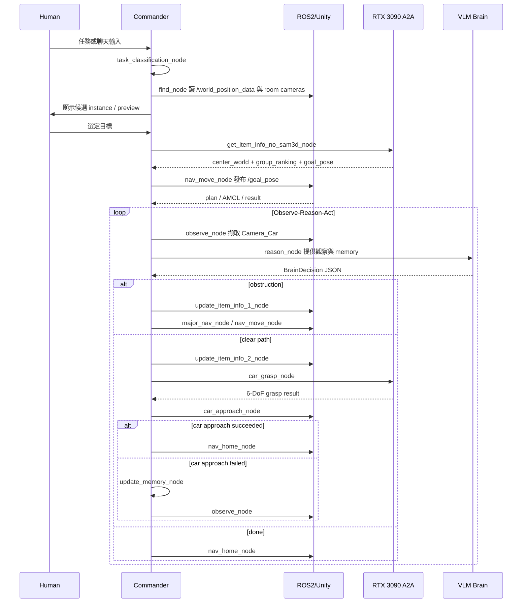

# VLM 多代理人抓取系統部署規格

本文件描述目前可部署版本的系統架構。主流程以 [langgraph_flow.png](langgraph_flow.png) 為準；導航由本機 ROS2/Nav2 執行，RTX 3090 端提供 item-info 與 grasp 兩個 A2A 服務；找物由 `find_node` 直接讀 `/world_position_data` 完成。

## 1. 架構概觀

```mermaid
graph TD
  subgraph Commander["本機 Commander / Docker"]
    Main[main.py / web_main.py]
    Graph[LangGraph Orchestrator]
    Brain[Brain: Ollama]
    State[CommanderState]
    Trace[TraceLogger + SessionMemoryStore]
    NavRunner[nav/move_runner.py]
    CarApproach[agents.car_approach subprocess]
  end

  subgraph RTX["RTX 3090 A2A Services"]
    ItemInfo[get_item_info_agent_no_sam3d :8006]
    Grasp[grasp_agent :8007]
  end

  subgraph ROS["ROS2 / Unity"]
    World[/world_position_data]
    RoomCams[Camera_Room1_12..15]
    CarCam[Camera_Car RGBD]
    Nav2[Nav2 + nav_goal_bridge_pkg]
    Control[car_control_pkg + arm_control_pkg]
  end

  Main --> Graph
  Graph --> Brain
  Graph <--> State
  Graph --> Trace
  Graph --> ItemInfo
  Graph --> Grasp
  Graph --> NavRunner
  Graph --> CarApproach
  Graph --> World
  Graph --> RoomCams
  ItemInfo --> RoomCams
  ItemInfo --> World
  Grasp --> CarCam
  NavRunner --> Nav2
  CarApproach --> Control
```

## 2. LangGraph 節點

| 節點 | 責任 |
|---|---|
| `greeting_node` | 啟動對話。 |
| `human_reply_node` | 讀取 stdin 或 web 介面輸入。 |
| `task_classification_node` | 判斷一般聊天或抓取任務，並對應 `config/objects.yaml`。 |
| `ai_reply_node` / `chat_memory_node` | 一般聊天回覆與短期聊天記憶。 |
| `input_node` | 確認抓取任務與目標 label。 |
| `find_node` | 讀取 `/world_position_data`，擷取 room cameras，列出候選 instance 給使用者確認。 |
| `get_item_info_no_sam3d_node` | 呼叫 no-SAM3D item-info A2A 服務，取得目標資訊與 ranked goal poses。 |
| `nav_move_node` | 發布 Nav2 goal pose，等待 plan 與 AMCL 到位。 |
| `observe_node` | 擷取 `Camera_Car` 觀察。 |
| `reason_node` | 呼叫 Brain，輸出下一步 `call_module`。 |
| `update_item_info_1_node` | major navigation 前刷新 world position，目標移動時重算 item info。 |
| `major_nav_node` | 切到下一個 ranked goal pose。 |
| `update_item_info_2_node` | grasp 前刷新 world position，目標移動時重算 item info。 |
| `car_grasp_node` | 呼叫 Grasp Agent，保存 `grasp_result`。 |
| `car_approach_node` | 啟動 car approach subprocess，完成底盤靠近與手臂/夾爪收尾；成功直接路由回 home，失敗才進 memory/observe。 |
| `update_memory_node` | 將最近 3 次行動摘要、key facts、latest result 寫回 state。 |
| `nav_home_node` / `goodbye_node` | 任務完成、失敗或結束時回 home 並結束 graph。 |

## 3. 決策輸出契約

`commander/brain.py` 會驗證 VLM 輸出為 `BrainDecision`：

```json
{
  "reasoning": "short reason",
  "call_module": "major_nav_node|grasp_agent|car_approach_agent|DONE",
  "module_params": {}
}
```

`call_module` 允許值為 `nav_agent`、`major_nav_node`、`grasp_agent`、`car_approach_agent`、`DONE`。`nav_agent` 是 backward-compatible alias，但 prompt 要求優先輸出 `major_nav_node`。`_route_decision` 會把決策對應到 `major_nav_node` / `car_grasp_node` / `end`。

## 4. 主序列



## 5. 狀態資料

`CommanderState`（`commander/state.py`，`TypedDict`）主要欄位：

| 欄位 | 說明 |
|---|---|
| `context_id` | A2A 與 session artifact 共用任務 ID。 |
| `task` | 抓取任務描述（`TaskContext`）。 |
| `requested_object` | 使用者確認後的目標物件。 |
| `selected_instance` | find/update item-info 使用的 instance metadata。 |
| `world_position` | 最新 `/world_position_data` snapshot。 |
| `room_cameras` | room camera 影像的 `ArtifactRef`。 |
| `item_info` | item-info 結果，含 `group_ranking` 展開後的 ranked goal poses。 |
| `navigation` | Nav2 goal 與 result 狀態。 |
| `observation` | `Camera_Car` 觀察。 |
| `decision` | 最近一次 Brain 決策紀錄。 |
| `grasp_result` | Grasp Agent 輸出的最佳與候選 grasp poses。 |
| `approach_result` | car approach 的底盤、手臂與夾爪結果。 |
| `last_execution` | 最近一次 node 執行結果。 |
| `session_summary` / `history_buffer` | 最近 3 次行動摘要與 key facts。 |

## 6. 失敗與恢復策略

- 找不到目標 instance：`find_node` 設為 `TARGET_NOT_FOUND`，路由到 `goodbye_node`。
- item-info 失敗或沒有 goal pose：路由 `nav_home_node`。
- world position 中目標消失：清空 goal pose，回 home。
- world position 中目標移動超過 `WORLD_POSITION_UPDATE_THRESHOLD_M`：重跑 `get_item_info_no_sam3d_node`。
- navigation 失敗：`current_status` 設為 `NAV_FAILED`，事件寫入 `navigation` 的 `NavResult.events`，後續 memory 讓 Brain 或路由選擇下一步。
- major navigation rank 耗盡：標記 task complete，回 home。
- car approach 成功：直接走 `end` 路由到 `nav_home_node`；失敗則寫入 `update_memory_node` 後回 `observe_node`。

## 7. 部署邊界

本機 Commander 負責：

- LangGraph 狀態機與 VLM 決策。
- 讀取 ROS2 topic、相機 topic、Nav2 result。
- 本機底盤/手臂/夾爪 subprocess。
- trace、session artifact 與 web UI。

RTX 3090 負責：

- no-SAM3D item-info 與 ranked goal pose（內部用 YOLO/SAM/幾何融合，:8006）。
- Camera_Car RGBD grasp pose generation（YOLO/SAM/GraspGen，:8007）。
- 另有 legacy SAM3D item-info 服務（:8008），預設不啟用。

ROS2/Unity 負責：

- `/world_position_data`、room camera、Camera_Car RGBD。
- Nav2 導航與 AMCL。
- 車體、手臂與夾爪 action server。
