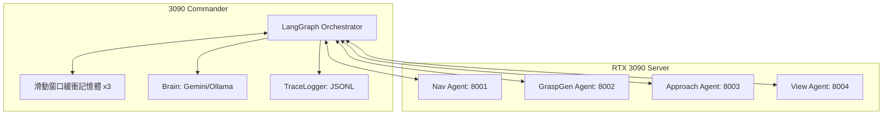
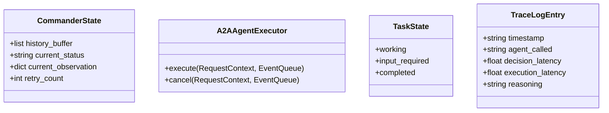
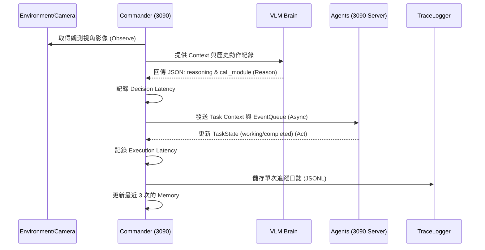
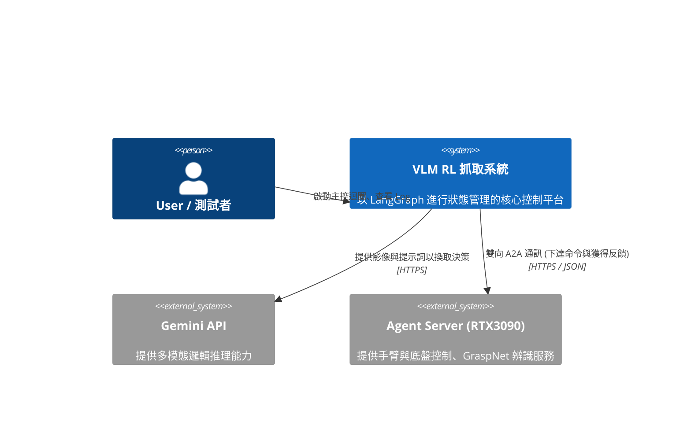
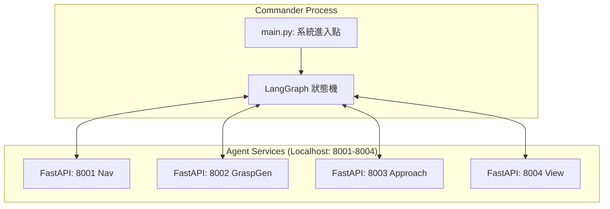
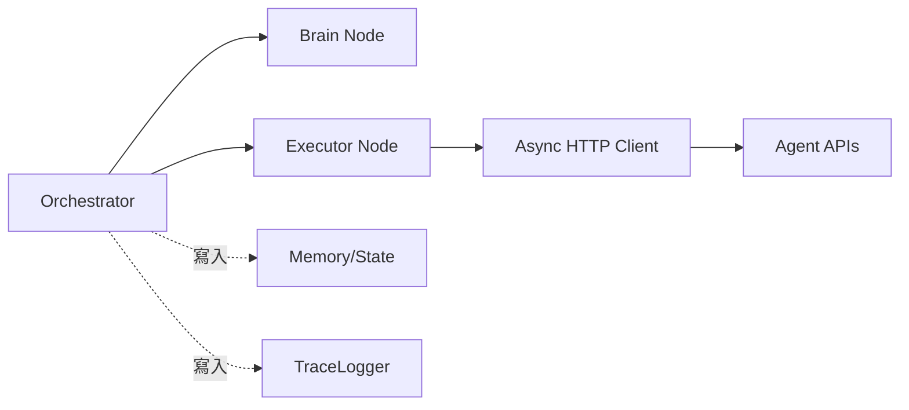
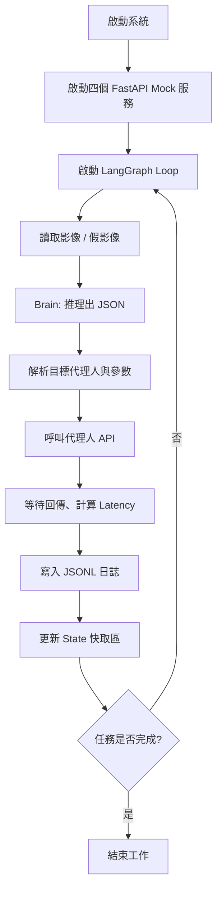
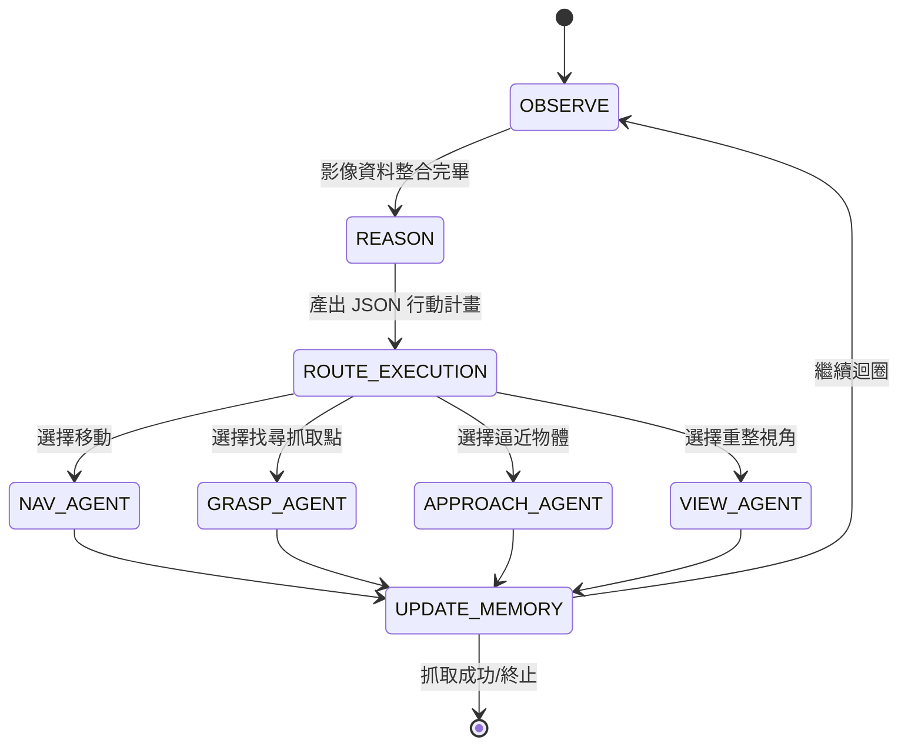

# 多代理人主動感知抓取系統 (VLM-RL) 規格文件

本文件描述基於 A2A (Act-to-Reason-to-Act) 架構與 LangGraph 狀態機框架的具身智慧 (Embodied AI) 機器人系統架構。針對 Day 1 實作，以 Mock 代理人鏈路為主。

## 1. 架構與選型

系統採用單機集中式設計，將 **RTX 3090 Server** 作為唯一運行平台，同時執行高層次的 LangGraph 狀態管理決策中樞，以及底層實際感知與動作任務的 Agent 服務。

## 2. 資料模型

定義 LangGraph 的全局狀態以及 A2A 協議的資料傳輸契約。

## 3. 關鍵流程

描述從取得影像、推理決策到代理人執行的主要閉迴路系統 (Observe -> Reason -> Act)。

## 4. 系統脈絡圖

定義整體系統的外部依賴與互動關係。

## 5. 容器/部署概觀

Day 1 開發階段中的網路端口部署對應關係全數運行於 3090 主機。

## 6. 模組關係圖

程式內碼元件的解耦設計結構。

## 7. 流程圖

Day 1 模擬測試流程的詳細步驟。

## 8. 狀態圖

LangGraph Node 轉換之狀態機拓撲。

