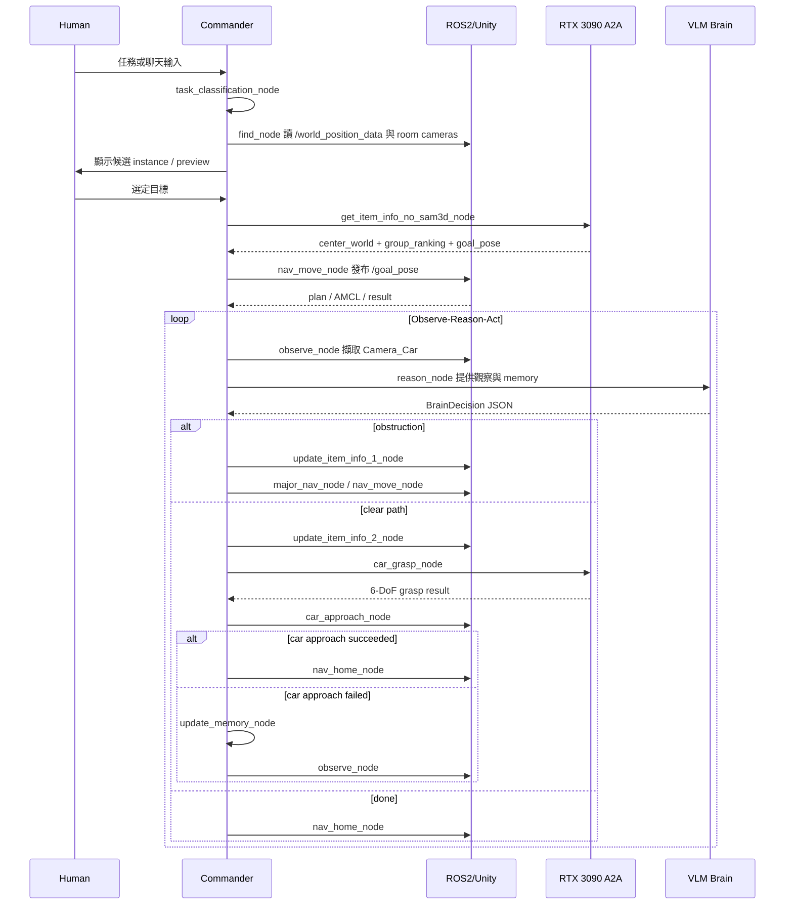

# VLM 多代理人抓取系統部署規格

本文件描述目前可部署版本的系統架構。主流程以 [langgraph_flow.png](langgraph_flow.png) 為準；導航由本機 ROS2/Nav2 執行，RTX 3090 端只保留找物、item-info 與 grasp 相關 A2A 服務。

> **消融實驗 A3（`w/o get_item_info_no_sam3d_node`）**：本實驗移除物體資訊估計。完整系統會呼叫 no-SAM3D item-info A2A 服務估計物體尺寸、yaw、grasp direction grouping 與 grasp 可行性的 ranked goal poses；A3 將 `get_item_info_no_sam3d_node` 改為**只根據目標物中心 + ROS keepout 地圖**產生候選導航點（預設 `fixed_offset` 模式）：以目標為圓心分 8 個方位（45°），每個方位從中心**往外推固定 0.6m**得到一個候選點，再檢查該點**機器車半徑 0.25m 範圍內有沒有黑色(障礙)格**——**沒有黑格才算可行**（白、灰皆可；黑色定義為 `pgm ≤ ABLATION_BLACK_THRESHOLD`，預設 50；設 `ABLATION_ROBOT_RADIUS_M=0` 則只看單格），**可行才留、不可行（不合法、不能跑）的方位直接丟掉**（候選數 ≤ 8），朝向一律幾何面向目標中心（不估計物體朝向、不做品質排序與觀察角度選擇，也不呼叫 A2A）。可行性**只看 footprint 圓**，畫面上的朝向箭頭只是示意、不參與判定。**只要沒有任何可行候選（8 方位全被障礙擋，或地圖讀不到）就直接判 NO_VALID_GOAL → 接到 END**，不再退回任何「不檢查」的固定距離環、也不會丟不能跑的點給 Nav2。亦可 `ABLATION_GOAL_MODE=sector_centroid` 改用扇區可走格形心。節點名稱與輸出契約不變，因此圖結構與報告視窗（`get_item_info_no_sam3d_node` → END）維持一致。每次執行會把一筆完整執行紀錄附加到 `result/result.json`（`A3_NNN`，id 依檔內現有最大值遞增），用來與完整系統比較成功率、完成時間、候選點數/嘗試數/成功排名、瓶頸節點與失敗階段，證明物體資訊估計對候選 goal pose 產生、觀察角度選擇、抓取可行性與整體任務成功率的幫助。候選點產生在 `workflow/commander/nav/ablation_goals.py`；可用 `ABLATION_GOAL_DISTANCE_M`（預設 0.6）、`ABLATION_GOAL_DIRECTIONS`（預設 8）、`ABLATION_ROBOT_RADIUS_M`（預設 0.25，footprint 判定半徑；設 0 則只看單格）、`ABLATION_BLACK_THRESHOLD`（預設 50，`pgm ≤` 此值視為黑/障礙）、`ABLATION_KEEPOUT_MAP_YAML` 調整。align 完會存一張 PNG `workflow/result/goal_pose_maps.png`（每次覆蓋）：**只畫可行（採用）的 goal pose**——綠點＋footprint 圈＋面向目標箭頭＋rank，紅十字=目標中心；**不可行的方位不顯示、也不列入候選**（全不可行時圖上只剩目標）。可用 `ABLATION_SAVE_GOAL_MAP=0` 關閉、`ABLATION_GOAL_MAP_DIR` 換目錄。

## 1. 架構概觀

```mermaid
graph TD
  subgraph Commander["本機 Commander / Docker"]
    Main[main.py / web_main.py]
    Graph[LangGraph Orchestrator]
    Brain[Brain: Gemini or Ollama]
    State[CommanderState]
    Trace[TraceLogger + SessionMemoryStore]
    NavRunner[nav_move_runner.py]
    CarApproach[agents.car_approach subprocess]
  end

  subgraph RTX["RTX 3090 A2A Services"]
    Find[find_agent :8005]
    ItemInfo[get_item_info_agent_no_sam3d :8006]
    Grasp[grasp_agent :8007]
  end

  subgraph ROS["ROS2 / Unity"]
    World[/world_position_data]
    RoomCams[Camera_Room1_12..15]
    CarCam[Camera_Car RGBD]
    Nav2[Nav2 + nav_goal_bridge_pkg]
    Control[car_control_pkg + arm_control_pkg]
  end

  Main --> Graph
  Graph --> Brain
  Graph <--> State
  Graph --> Trace
  Graph --> Find
  Graph --> ItemInfo
  Graph --> Grasp
  Graph --> NavRunner
  Graph --> CarApproach
  Find --> RoomCams
  ItemInfo --> RoomCams
  ItemInfo --> World
  Grasp --> CarCam
  NavRunner --> Nav2
  CarApproach --> Control
```

## 2. LangGraph 節點

| 節點 | 責任 |
|---|---|
| `greeting_node` | 啟動對話。 |
| `human_reply_node` | 讀取 stdin 或 web 介面輸入。 |
| `task_classification_node` | 判斷一般聊天或抓取任務，並對應 `config/objects.yaml`。 |
| `ai_reply_node` / `chat_memory_node` | 一般聊天回覆與短期聊天記憶。 |
| `input_node` | 確認抓取任務與目標 label。 |
| `find_node` | 讀取 `/world_position_data`，擷取 room cameras，列出候選 instance 給使用者確認。 |
| `get_item_info_no_sam3d_node` | **（A3 消融）** 不呼叫 item-info A2A、不估計物體資訊；以目標物中心 + keepout 地圖，8 方位各往外推 0.4m，落在可行範圍（白區+footprint）才留、不可走方位丟棄（geometric order，非品質排序）。 |
| `nav_move_node` | 發布 Nav2 goal pose，等待 plan 與 AMCL 到位。 |
| `observe_node` | 擷取 `Camera_Car` 觀察。 |
| `reason_node` | 呼叫 Brain，輸出下一步 `call_module`。 |
| `update_item_info_1_node` | major navigation 前刷新 world position，目標移動時重算 item info。 |
| `major_nav_node` | 切到下一個 ranked goal pose。 |
| `update_item_info_2_node` | grasp 前刷新 world position，目標移動時重算 item info。 |
| `car_grasp_node` | 呼叫 Grasp Agent，保存 `latest_grasp_result`。 |
| `car_approach_node` | 啟動 car approach subprocess，完成底盤靠近與手臂/夾爪收尾；成功直接路由回 home，失敗才進 memory/observe。 |
| `update_memory_node` | 將最近 3 次行動摘要、key facts、latest result 寫回 state。 |
| `nav_home_node` / `goodbye_node` | 任務完成、失敗或結束時回 home 並結束 graph。 |

## 3. 決策輸出契約

`commander/brain.py` 會驗證 VLM 輸出為 `BrainDecision`：

```json
{
  "reasoning": "short reason",
  "call_module": "major_nav_node|grasp_agent|car_approach_agent|DONE",
  "module_params": {}
}
```

`nav_agent` 仍被視為 backward-compatible alias，但 prompt 要求優先輸出 `major_nav_node`。`arm_approach_agent` 不由目前主流程直接呼叫。

## 4. 主序列



## 5. 狀態資料

主要 state 欄位：

| 欄位 | 說明 |
|---|---|
| `context_id` | A2A 與 session artifact 共用任務 ID。 |
| `target_object` | 使用者確認後的目標資料，後續合併 item-info 結果。 |
| `selected_target` | find/update item-info 使用的 instance metadata。 |
| `world_position_db` | 最新 `/world_position_data` snapshot。 |
| `goal_pose_db` | `group_ranking` 展開後的 ranked goal pose 資料。 |
| `nav_goal_pose` | 下一次 Nav2 要執行的目標 pose。 |
| `latest_grasp_result` | Grasp Agent 輸出的最佳與候選 grasp poses。 |
| `latest_approach_result` | car approach 的底盤、手臂與夾爪結果。 |
| `history_buffer` | 最近 3 次行動摘要與 key facts。 |

## 6. 失敗與恢復策略

- 找不到目標 instance：`find_node` 設為 `TARGET_NOT_FOUND`，路由到 `goodbye_node`。
- item-info 失敗或沒有 goal pose：路由 `nav_home_node`。
- world position 中目標消失：清空 goal pose，回 home。
- world position 中目標移動超過 `WORLD_POSITION_UPDATE_THRESHOLD_M`：重跑 `get_item_info_no_sam3d_node`。
- navigation 失敗：寫入 `NAV_FAILED` 與 `nav_move_events`，後續 memory 讓 Brain 或路由選擇下一步。
- major navigation rank 耗盡：標記 task complete，回 home。
- car approach 成功：直接走 `end` 路由到 `nav_home_node`；失敗則寫入 `update_memory_node` 後回 `observe_node`。

## 7. 部署邊界

本機 Commander 負責：

- LangGraph 狀態機與 VLM 決策。
- 讀取 ROS2 topic、相機 topic、Nav2 result。
- 本機底盤/手臂/夾爪 subprocess。
- trace、session artifact 與 web UI。

RTX 3090 負責：

- YOLO 找物與標註。
- no-SAM3D item-info 與 ranked goal pose。
- Camera_Car RGBD grasp pose generation。

ROS2/Unity 負責：

- `/world_position_data`、room camera、Camera_Car RGBD。
- Nav2 導航與 AMCL。
- 車體、手臂與夾爪 action server。
